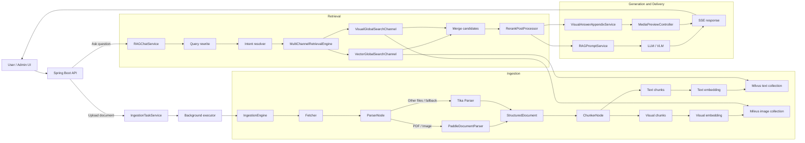

# SageDesk


SageDesk is an enterprise knowledge assistant built around RAG, multimodal document understanding, streaming chat, model routing, and operationally safe document ingestion.

It is designed for scenarios where knowledge is scattered across policies, product manuals, PDFs, scanned pages, screenshots, charts, and long-running conversations.

## Highlights

- **Multimodal RAG**: parses PDF/image documents into text blocks and visual blocks, then supports text retrieval, visual retrieval, image-grounded answers, and image preview in chat results.
- **Async ingestion pipeline**: processes documents through `fetcher -> parser -> chunker -> indexer` with task status tracking, staged uploads, restart recovery, and distributed recovery locking.
- **Hybrid retrieval architecture**: combines intent-directed retrieval, vector global search, visual global search, rerank, and context formatting before generation.
- **Model routing**: supports multiple chat, embedding, and rerank providers with priority-based selection, fallback, circuit breaking, and multimodal model constraints.
- **Streaming UX**: returns chat responses over SSE and appends source evidence, including related images when visual chunks are retrieved.
- **Traceability**: records retrieval and generation traces so query rewrite, channel recall, rerank, and final context can be inspected.

## Architecture



## Core Flow

### Document ingestion

1. A document upload creates an ingestion task and returns quickly.
2. The background executor runs the configured pipeline.
3. `ParserNode` selects a parser by file type and pipeline rule.
4. PDF and image inputs can use Paddle document analysis; other inputs can use Tika or fallback parsing.
5. `ChunkerNode` produces both normal text chunks and visual chunks.
6. Text chunks and visual chunks are embedded separately.
7. `IndexerNode` writes text chunks to the text collection and visual chunks to the image collection.

### Retrieval and answer generation

1. `RAGChatService` loads conversation memory and rewrites the user query.
2. `IntentResolver` determines whether the query should use system, knowledge-base, MCP, or fallback retrieval.
3. `MultiChannelRetrievalEngine` runs enabled channels in parallel.
4. `VectorGlobalSearchChannel` searches compatible text collections.
5. `VisualGlobalSearchChannel` searches image collections named with the configured image suffix.
6. `RerankPostProcessor` switches to the visual rerank model when visual chunks are present.
7. `RAGPromptService` builds structured chat messages. When image evidence exists, image payloads are attached as multimodal message parts.
8. The answer streams back to the frontend, and related images are appended through the media preview endpoint.

## Feature Set

- Knowledge base creation and document management
- PDF, text, and image-oriented document ingestion
- Structure-aware chunking
- Text and visual vector indexing
- Global vector search and visual global search
- Rerank-based evidence refinement
- Conversation memory and summary compression
- Query rewrite and multi-question splitting
- MCP tool invocation integration
- SSE streaming chat
- Model provider routing and fallback
- Retrieval trace and dashboard-oriented observability
- Media preview for retrieved image evidence

## Tech Stack

- **Backend**: Java 17, Spring Boot 3, MyBatis-Plus, Sa-Token
- **Frontend**: React 18, Vite, TypeScript, Tailwind CSS
- **Storage**: MySQL, Redis, Milvus, S3-compatible object storage
- **Document processing**: Apache Tika, Paddle document analysis
- **AI providers**: configurable chat, embedding, rerank, and multimodal model providers
- **Concurrency**: dedicated executors, `CompletableFuture`, Redis/Redisson coordination

## Project Structure

```text
bootstrap/      Spring Boot application, controllers, RAG, ingestion, knowledge services
framework/      Shared conventions, context, tracing, and common infrastructure
infra-ai/       Chat, embedding, rerank, provider routing, and model selection
frontend/       React admin console and chat UI
resources/      Docker and local infrastructure resources
docs/           Development notes and examples
```

## Configuration

Runtime secrets should be provided through environment variables. Do not commit real provider keys.

```powershell
$env:BAILIAN_API_KEY="your-bailian-api-key"
$env:PADDLE_API_KEY="your-paddle-api-key"
```

Common local overrides:

```powershell
$env:PADDLE_PROVIDER="official"
$env:PADDLE_REQUEST_MODE="async"
$env:PADDLE_RESULT_DOWNLOAD_DIR="scripts/paddle_api_runtime"
```

Start local Hugging Face retrieval bridges:

```powershell
.\scripts\start_hf_embedding_bridge.ps1
.\scripts\start_qwen_vl_embedding_bridge.ps1
.\scripts\start_hf_rerank_bridge.ps1
```

Or start all local AI bridge processes, including Paddle document analysis:

```powershell
.\scripts\start_local_ai_bridges.ps1
```

The default backend context path is:

```text
/api/ragent
```

The frontend can keep using:

```env
VITE_API_BASE_URL=/api/ragent
```

## Local Development

Start the backend:

```bash
mvn -pl bootstrap spring-boot:run
```

Start the frontend:

```bash
cd frontend
npm install
npm run dev
```

Run backend compile checks:

```bash
mvn -q -pl bootstrap -am test-compile -DskipTests
```

Run selected tests:

```bash
mvn -q -pl bootstrap -am test
```

## Notes

- The repository uses environment variables for AI provider keys.
- Local infrastructure addresses and development credentials are intended for local profiles only and should be replaced in deployed environments.
- Multimodal retrieval uses separate text and image vector spaces because embedding dimensions, metadata, and retrieval strategies differ.
- Visual search retrieves visual chunks first; image-grounded reasoning happens when retrieved image evidence is attached to the multimodal chat request.

## License

Apache License 2.0.
